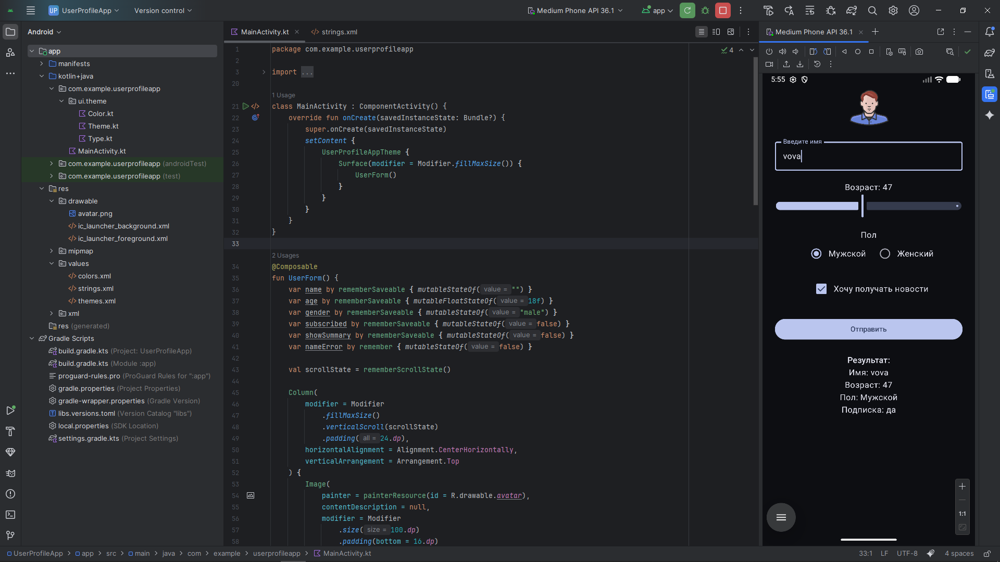

# UserProfileApp

Приложение на Kotlin + Jetpack Compose для заполнения анкеты пользователя.

## Функции
- Ввод имени  
- Выбор возраста (Slider)  
- Выбор пола (RadioButton)  
- Подписка на новости (Checkbox)  
- Отображение итоговой сводки  
- Поддержка светлой и тёмной темы  
- Адаптивный интерфейс для портретной и ландшафтной ориентации  

## Скриншот

